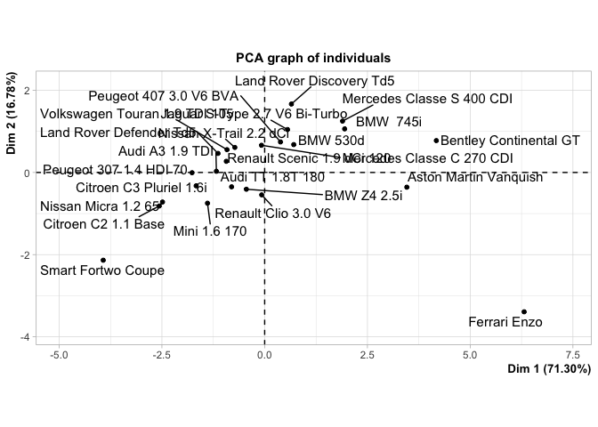
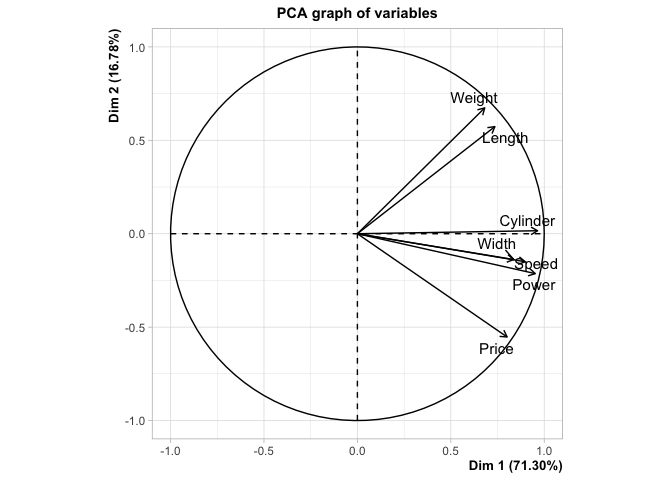

Principal Component Analysis : A Generalized Gini Approach
================
Arthur Charpentier, Stéphane Mussard & Téa Ouraga

``` r
library(knitr)
library(plotrix)
library(FactoMineR)
download.file(url = "http://freakonometrics.free.fr/cars.csv", destfile = "cars.csv")
df = read.table("cars.csv",sep=";",header=TRUE)
X  = df[,2:8]
rownames(X) = as.character(df[,1])
colnames(X) = names(df[,2:8])
n = nrow(X)
k = ncol(X)
```

Set the risk aversion parameter,

``` r
nu = 1.4
```

# Gini correlation

Define the decumulative matrix of ranks of `X`,

``` r
rX = matrix(1,n,k)  
for (i in 1:k) 
  {
    rX[,i] = (n+1)*rX[,i] - rank(X[,i],T, "average")
    rX[,i] = (rX[,i])^(nu-1) - mean((rX[,i])^(nu-1))*matrix(1,n,1)
  }
```

Define then a centered version of `X`

``` r
Xc = matrix(0,n,k) 
for (i in 1:k) 
  {
    Xc[,i] = X[,i] - mean(X[,i])*matrix(1,n,1)
  }
```

Matrix `GMDX` is then defined as

``` r
GMDX = (-2/(n*(n-1)))*nu * t(Xc) %*% rX
deno1 = matrix(0,k,k)
for (i in 1:k) 
      {
        deno1[i,] = matrix(1,1,k)*GMDX[i,i]
      }
```

Gini Correlation matrix of `X`, `GMDX` is then

``` r
GCX = GMDX / deno1   
```

# Eigenvalues and eigenvectors

Then set `GMD`

``` r
GMD = t(GCX) + GCX     
```

with eigenvalues

``` r
valP = eigen(GMD)$values 
```

with eigenvectors

``` r
vecP = eigen(GMD)$vectors   
```

Percentages of eigenvalues are

``` r
Pva = matrix(0,1,k)       
for (i in 1:k) 
  {
    Pva[i] = valP[i] / (sum(abs(valP)))
  }
```

Matrix `Z` of standardized variables is then

``` r
Z = matrix(0,n,k)
for (i in 1:k) 
  {
    Z[,i] = Xc[,i] / GMDX[i,i] 
  }
```

Define then ranks of matrix `Z`

``` r
rZ = matrix(0,n,k)
for (i in 1:k) 
  {
    rZ[,i] = (n+1)*matrix(1,n,1) - rank(Z[,i],T, "average") 
    rZ[,i] = (rZ[,i])^(nu-1) - mean((rZ[,i])^(nu-1))*matrix(1,n,1)
  }
```

and then matrix of correlation `GMDZ`

``` r
GMDZ = (-2/(n*(n-1)))*nu * t(Z) %*% rZ
```

Projection of the individuals in the new space

``` r
F1 = Z %*% vecP  
```

Define contributions `CTA` for individuals

``` r
CTAi = matrix(0,n,k)
for (i in 1:k) 
  {
    CTAi[,i] = ( (-2/(n*(n-1)))* nu * (F1[,i]*(rZ%*%vecP[,i])) ) / (valP[i]/2) 
  }
CTAi = CTAi*100
(V0 = apply(CTAi, 2, sum))
```

    ## [1] 100 100 100 100 100 100 100

In the new space, the \((G)\)-correlation between the new axes and the
variables (slope coefficients of Gini regression) is

``` r
GMDFZ = t(F1) %*% rZ / diag( t(Z)%*%rZ )
```

Relative contributions are here

``` r
CTRi = matrix(0,n,k)
for (i in 1:n) 
  {
  CTRi[i,] = abs(F1[i,]) / sum(abs(F1[i,])) 
  }
CTRi = CTRi*100
(V2 = apply(CTRi, 1, sum))
```

    ##  [1] 100 100 100 100 100 100 100 100 100 100 100 100 100 100 100 100 100 100 100
    ## [20] 100 100 100 100 100

The \(G\)-correlation matrix
    is

``` r
GCX 
```

    ##           [,1]      [,2]      [,3]      [,4]      [,5]      [,6]      [,7]
    ## [1,] 1.0000000 0.9773211 0.9365744 0.7024963 0.8507394 0.6656793 0.9485641
    ## [2,] 0.9571243 1.0000000 0.9750576 0.5269443 0.7936447 0.5366847 0.9323170
    ## [3,] 0.8776708 0.9645492 1.0000000 0.4243506 0.6733056 0.5409199 0.8347394
    ## [4,] 0.7492242 0.6302858 0.5072831 1.0000000 0.7587116 0.7766934 0.6700122
    ## [5,] 0.7895826 0.7842429 0.7050387 0.4992108 1.0000000 0.6319374 0.8175580
    ## [6,] 0.8075606 0.7173621 0.6818062 0.8387230 0.8335396 1.0000000 0.7161794
    ## [7,] 0.9273737 0.9750682 0.9620391 0.2145560 0.8914236 0.3668078 1.0000000

Project
    individuals

``` r
F1
```

    ##             [,1]       [,2]          [,3]       [,4]        [,5]        [,6]
    ##  [1,]  32.094566   8.519876   3.463971595 -0.7809453 -2.13652820 -0.82849558
    ##  [2,]  49.379294  25.620226   0.687869352 15.5885317 -1.32836399 -0.46366239
    ##  [3,]  18.204117  10.472444  -4.682820562  2.3216576  5.73807935  1.24691274
    ##  [4,]  31.058415   7.238678   3.440555905 -0.4684075 -3.11330180 -1.40829909
    ##  [5,]   2.148929   8.796280  -5.750203723  3.9720055  6.50252756  1.52265167
    ##  [6,]  14.721940  -1.480946   2.021995341 -3.2511531 -1.15958064  0.88867048
    ##  [7,]  21.797150  -2.326951   5.417411254 -4.6031456 -2.89606465 -1.24499133
    ##  [8,]  -4.231163  -8.248165  -5.044353681 -5.3422952  0.57307879  0.15543932
    ##  [9,]   1.660837  -6.573189  -7.979042999 -4.8080200 -0.05282141  2.34511368
    ## [10,]  -8.526709  -7.262377  -3.909263745 -9.3540856  0.54487654  1.13564848
    ## [11,]  -6.681116 -12.246813  -4.633145869 -7.9956683  0.33289445 -0.17509957
    ## [12,] -23.660172 -11.131949  -7.353883500 -4.4270583 -1.56953911 -2.89157608
    ## [13,] -23.047549 -16.026086   2.429334761 -5.0209444  5.02998027  2.34102082
    ## [14,]  21.191332   3.475660  -0.172855537 -1.6568263  0.23463880 -0.05839373
    ## [15,]   6.247927   6.350113  -3.170295290 -3.5354517  2.87797982  1.98081701
    ## [16,]  10.681839   5.121575  -2.605380927 -3.4226195  5.61355933  1.13006885
    ## [17,] -43.918830   9.542121 -10.216817171  3.9538896 -8.10021167  0.40535119
    ## [18,] -51.448337  -3.264807 -19.601229054  9.6802647  1.08922227 -3.41838708
    ## [19,] -85.337996  40.952440  32.363522602  3.4096434 -7.57725614 -0.97340056
    ## [20,]  11.763700  -4.798534   2.472075406 -1.8335151  0.99910166  0.59681300
    ## [21,]  11.432810  -8.584684   2.336387205 -2.4046749 -0.72919983  0.37408864
    ## [22,]  14.178347  -8.500570   3.257933953 13.8250949 -3.79796497 -2.07233648
    ## [23,]  -8.825602 -26.984832  17.237117572  8.5186318  5.41439664  0.94953705
    ## [24,]   9.116270  -8.659512  -0.008882887 -2.3649084 -2.48950306 -1.53749103
    ##               [,7]
    ##  [1,]  -0.24522542
    ##  [2,]  -1.35794963
    ##  [3,]  -0.69800128
    ##  [4,]  -0.14503486
    ##  [5,]   5.56068868
    ##  [6,]  -0.21422174
    ##  [7,]  -1.31321923
    ##  [8,]   1.52387592
    ##  [9,]  -0.09376893
    ## [10,]   0.62532553
    ## [11,]  -1.66068053
    ## [12,]   5.29544278
    ## [13,]   7.83273663
    ## [14,]  -0.03652191
    ## [15,]   2.84430021
    ## [16,]  -0.44941665
    ## [17,]  -0.12573224
    ## [18,]   0.95846212
    ## [19,] -15.89465447
    ## [20,]  -0.64313014
    ## [21,]  -1.44915679
    ## [22,]   0.73734131
    ## [23,]  -0.03347317
    ## [24,]  -1.01798620

Individuals \(CTA\)
    are

``` r
CTAi
```

    ##              [,1]        [,2]         [,3]        [,4]        [,5]         [,6]
    ##  [1,]  6.73086416  0.92122313 -0.454322586  0.21359378 -1.17324985  -11.4770700
    ##  [2,] 10.52699928  5.39047718  0.112284260  2.33135686  3.97557236   -1.6475524
    ##  [3,]  2.35006800  3.32705951  2.887620787  0.45939285 20.17660373  -51.0341792
    ##  [4,]  6.22460580  0.52409255  0.006748511  0.05223784  1.85083749   17.9628724
    ##  [5,] -0.05806299  4.12501527  2.377483450  3.18710667 26.37363200  -12.9643989
    ##  [6,]  1.48033296  0.02536158  0.174860920  1.17361775  1.48839597   50.7780426
    ##  [7,]  3.46670602  0.08709576  0.934196324  3.33277127  0.05277008    0.8049954
    ##  [8,]  0.23495768  1.07736684  0.212591749 -1.01441663 -0.68496862   -7.3554778
    ##  [9,]  0.02584967  0.69210537  8.339463472  0.76923375  0.10904535   83.8199135
    ## [10,]  1.07478751 -0.10801862 -0.671839737 10.17904360 -2.08377582   -8.9905987
    ## [11,]  0.67554620  4.08301093 -0.860062374  6.63715733 -1.10529222    3.7994102
    ## [12,]  4.96874070  2.51661719  2.484637861  3.17101237  3.97014926   93.1242523
    ## [13,]  4.79883996  8.85558706  0.266223421  6.47447972 15.43894414  -21.1969136
    ## [14,]  3.35545773  0.35787405  0.042886635  0.94830289  0.42343240    0.5179742
    ## [15,]  0.13280021  2.82854195  0.653806789  1.00513069  1.48050724   23.9880883
    ## [16,]  0.88311862  1.21077090  0.877429226  0.63000400 16.57860664  -62.1828642
    ## [17,]  9.71411005  2.84979332  0.576660647  4.23250634 -2.57747066   15.6000317
    ## [18,] 14.41269105  0.39553563 20.646750689 12.85987148  1.12213046 -129.1188891
    ## [19,] 24.77350960 34.10887441 26.099444129 -2.12768515 -8.68998980    7.1928522
    ## [20,]  0.94587277  0.70562918  0.794097903  0.54580335  3.73000767   22.5494632
    ## [21,]  1.05740068  2.43004891  0.807815645  0.32104461 -0.61304215   13.8648075
    ## [22,]  0.95225134  1.78427118  0.938944698 31.15776305 13.26628541    9.5939569
    ## [23,]  0.67239925 20.06691763 32.751695217 13.60419516  0.94038184   14.1004267
    ## [24,]  0.60015377  1.74474909  0.000582363 -0.14352359  5.95048707   48.2708569
    ##              [,7]
    ##  [1,]   0.9247044
    ##  [2,]  -8.1836346
    ##  [3,]   0.5381520
    ##  [4,]   0.4647054
    ##  [5,] -70.4857398
    ##  [6,]   0.3232062
    ##  [7,]   2.7895907
    ##  [8,]  -6.0571714
    ##  [9,]  -0.1425353
    ## [10,]   1.8311904
    ## [11,] -20.6257113
    ## [12,]  33.2559884
    ## [13,] -28.7484586
    ## [14,]   0.2027205
    ## [15,]  14.1291724
    ## [16,]  -1.4717791
    ## [17,]  -0.5164638
    ## [18,]   1.8951419
    ## [19,] 168.9948218
    ## [20,]   2.8325977
    ## [21,]   9.2112140
    ## [22,]   1.1982319
    ## [23,]  -0.3875609
    ## [24,]  -1.9723830

while individuals \(CTR\)
    are

``` r
CTRi
```

    ##            [,1]      [,2]        [,3]       [,4]       [,5]      [,6]
    ##  [1,] 66.766857 17.724038  7.20615734  1.6246135  4.4446549 1.7235330
    ##  [2,] 52.294228 27.132626  0.72847532 16.5087463  1.4067793 0.4910331
    ##  [3,] 41.979760 24.150070 10.79885850  5.3538785 13.2323471 2.8754538
    ##  [4,] 66.261214 15.443274  7.34021393  0.9993185  6.6420375 3.0045193
    ##  [5,]  6.273643 25.680105 16.78730532 11.5959838 18.9836605 4.4452718
    ##  [6,] 62.017128  6.238579  8.51778638 13.6956933  4.8848086 3.7435820
    ##  [7,] 55.044792  5.876296 13.68070013 11.6244182  7.3134917 3.1440022
    ##  [8,] 16.844895 32.837181 20.08232797 21.2684779  2.2815126 0.6188272
    ##  [9,]  7.063548 27.955797 33.93490083 20.4485276  0.2246497 9.9737776
    ## [10,] 27.191247 23.159355 12.46644610 29.8297101  1.7375840 3.6215261
    ## [11,] 19.810329 36.313303 13.73784545 23.7081365  0.9870729 0.5191917
    ## [12,] 42.003073 19.762159 13.05509155  7.8592013  2.7863478 5.1333136
    ## [13,] 37.337479 25.962572  3.93556968  8.1340278  8.1486661 3.7924994
    ## [14,] 78.994824 12.956202  0.64435273  6.1761432  0.8746619 0.2176740
    ## [15,] 23.134571 23.512943 11.73884125 13.0909276 10.6564673 7.3344892
    ## [16,] 36.802888 17.645720  8.97650106 11.7921903 19.3407884 3.8935052
    ## [17,] 57.588683 12.512131 13.39682874  5.1845482 10.6214241 0.5315178
    ## [18,] 57.509422  3.649431 21.91043337 10.8206886  1.2175426 3.8211044
    ## [19,] 45.755452 21.957363 17.35226595  1.8281396  4.0626778 0.5219057
    ## [20,] 50.909968 20.766699 10.69844400  7.9349354  4.3238297 2.5828381
    ## [21,] 41.861556 31.433062  8.55474741  8.8047846  2.6699857 1.3697361
    ## [22,] 30.576822 18.332209  7.02601445 29.8150049  8.1906377 4.4691717
    ## [23,] 12.985779 39.704836 25.36228250 12.5341110  7.9666137 1.3971261
    ## [24,] 36.183494 34.370572  0.03525717  9.3865860  9.8811160 6.1024738
    ##              [,7]
    ##  [1,]  0.51014650
    ##  [2,]  1.43811144
    ##  [3,]  1.60963183
    ##  [4,]  0.30942294
    ##  [5,] 16.23402983
    ##  [6,]  0.90242295
    ##  [7,]  3.31629954
    ##  [8,]  6.06677842
    ##  [9,]  0.39879963
    ## [10,]  1.99413177
    ## [11,]  4.92412134
    ## [12,]  9.40081390
    ## [13,] 12.68918607
    ## [14,]  0.13614253
    ## [15,] 10.53175985
    ## [16,]  1.54840660
    ## [17,]  0.16486674
    ## [18,]  1.07137774
    ## [19,]  8.52219565
    ## [20,]  2.78328556
    ## [21,]  5.30612830
    ## [22,]  1.59013987
    ## [23,]  0.04925162
    ## [24,]  4.04050103

# Testing for correlations between the Variables (Z) and the components (F)

``` r
axe1 = matrix(0,n,k)
axe2 = matrix(0,n,k)
for (i in 1:n) {
  Stock1 = matrix(0,k,k)
  F12    = F1[-i,]
  Z12    = matrix(0, n-1, k)
  Z12    = Z[-i,]
  rZ12   = matrix(0, n-1, k)
  for (j in 1:k) {
    rZ12[,j] = n - rank(Z12[,j], T, "average")
    rZ12[,j] = rZ12[,j]^(nu-1) - mean( rZ12[,j]^(nu-1) )
  }
  Stock1 = (t(F12) %*% rZ12)
  B = diag( t(Z12) %*% rZ12 )
  for (j in 1:k) {
    Stock1[,j] = Stock1[,j] / B[j]
    }
  axe1[i,] = Stock1[1,]
  axe2[i,] = Stock1[2,]
}
colnames(axe1) = colnames(axe2) = colnames(X) 
```

Use Jackknife to compute standard deviations,

``` r
ET_jkf = matrix(0,2,k)
for ( i in 1:k) 
{
  ET_jkf[1,i] = (((n-1)/n)*colSums( (axe1[,i]-mean(axe1[,i])*matrix(1,n,1))^2 ) )^(0.5)
  ET_jkf[2,i] = (((n-1)/n)*colSums( (axe2[,i]-mean(axe2[,i])*matrix(1,n,1))^2 ) )^(0.5)
}
ratio = matrix(0, 2, k)
ratio[1,] = GMDFZ[1,] / ET_jkf[1,]
ratio[2,] = GMDFZ[2,] / ET_jkf[2,]

colnames(ratio) = colnames(X)
row.names(ratio) = c("axe1","axe2")
axe1
```

    ##        Cylinder     Power     Speed    Weight     Width    Length     Price
    ##  [1,] -2.303503 -2.275872 -2.203215 -1.509485 -2.143197 -1.638090 -2.175255
    ##  [2,] -2.255225 -2.196668 -2.149706 -1.467459 -2.150562 -1.790287 -2.138389
    ##  [3,] -2.324033 -2.306724 -2.202595 -1.510828 -2.186201 -1.712722 -2.226373
    ##  [4,] -2.298194 -2.277310 -2.201344 -1.507000 -2.147459 -1.634522 -2.178793
    ##  [5,] -2.336726 -2.349668 -2.229064 -1.569067 -2.168611 -1.736846 -2.232112
    ##  [6,] -2.321616 -2.316565 -2.222586 -1.515674 -2.169308 -1.648720 -2.220700
    ##  [7,] -2.325707 -2.313670 -2.237531 -1.503893 -2.153577 -1.637365 -2.214453
    ##  [8,] -2.323473 -2.307259 -2.207593 -1.553300 -2.163332 -1.668269 -2.230272
    ##  [9,] -2.322455 -2.318276 -2.211768 -1.558979 -2.225977 -1.644995 -2.239086
    ## [10,] -2.311874 -2.301060 -2.199524 -1.550119 -2.164890 -1.772887 -2.239633
    ## [11,] -2.315864 -2.302686 -2.204670 -1.542906 -2.161144 -1.797360 -2.237798
    ## [12,] -2.359711 -2.320916 -2.150272 -1.526635 -2.143276 -1.715510 -2.192754
    ## [13,] -2.325225 -2.263612 -2.152972 -1.541882 -2.331082 -1.723891 -2.206636
    ## [14,] -2.313981 -2.293263 -2.211283 -1.506698 -2.169095 -1.653079 -2.224228
    ## [15,] -2.319209 -2.311302 -2.224242 -1.542765 -2.180688 -1.677784 -2.248323
    ## [16,] -2.337206 -2.311970 -2.204567 -1.527356 -2.178317 -1.671584 -2.228650
    ## [17,] -2.414751 -2.340925 -2.180810 -1.428915 -2.088033 -1.610535 -2.416726
    ## [18,] -2.400840 -2.427537 -2.166637 -1.433192 -2.051975 -1.576159 -2.218902
    ## [19,] -2.084934 -2.276521 -1.981134 -1.712870 -2.465205 -1.501857 -3.727692
    ## [20,] -2.329357 -2.314821 -2.226603 -1.556166 -2.171308 -1.649703 -2.247743
    ## [21,] -2.328305 -2.328414 -2.240700 -1.554095 -2.171683 -1.646440 -2.249858
    ## [22,] -2.319329 -2.308006 -2.332374 -1.597025 -2.170138 -1.682467 -2.229677
    ## [23,] -2.324018 -2.341270 -2.370463 -1.734313 -2.538059 -1.714020 -2.229058
    ## [24,] -2.322620 -2.313026 -2.247330 -1.554361 -2.180653 -1.646419 -2.231144

Results of the Test, \((U)\)-stat of the correlations between variables
and
    components

``` r
ratio 
```

    ##         Cylinder       Power      Speed    Weight      Width    Length
    ## axe1 -8.47272337 -12.3075448 -6.7904505 -4.790038 -4.3738827 -5.363089
    ## axe2 -0.03780658   0.3572239  0.6136172 -2.950509 -0.2397706 -3.552067
    ##           Price
    ## axe1 -1.5494646
    ## axe2  0.1211281

The graph with percentages of eigenvalues

``` r
barplot(Pva*100, main="Eigenvalues (in %)",ylim = c(0,100))  
```

<!-- -->

Two-dimensional scatterplot

``` r
plot(F1[,1], F1[,2], pch=16, col="red", 
     main="Projection of Individuals Gini-PCA",
     xlab=paste("First compoment (",round(Pva[1]*100,2),"%)",sep=""), 
     ylab=paste("Second compoment (",round(Pva[2]*100,2),"%)",sep=""))
```

<!-- -->

Classical
\(L^2\)-PCA

``` r
res.pca = FactoMineR::PCA(X)
```

<!-- --><!-- -->

``` r
round(res.pca$ind$coord, 3)
```

    ##                                Dim.1  Dim.2  Dim.3  Dim.4  Dim.5
    ## Citroen C2 1.1 Base           -2.564 -0.816  0.118 -0.172  0.166
    ## Smart Fortwo Coupe            -3.928 -2.136 -0.479  0.918 -0.007
    ## Mini 1.6 170                  -1.391 -0.748 -0.574  0.031 -0.445
    ## Nissan Micra 1.2 65           -2.485 -0.720  0.148 -0.124  0.255
    ## Renault Clio 3.0 V6           -0.073 -0.545 -0.715  0.216 -0.585
    ## Audi A3 1.9 TDI               -1.175  0.029  0.221 -0.261  0.103
    ## Peugeot 307 1.4 HDI 70        -1.766 -0.006  0.527 -0.347  0.293
    ## Peugeot 407 3.0 V6 BVA         0.385  0.743 -0.189 -0.319  0.037
    ## Mercedes Classe C 270 CDI     -0.077  0.661 -0.421 -0.323  0.059
    ## BMW 530d                       0.708  0.678 -0.127 -0.662  0.013
    ## Jaguar S-Type 2.7 V6 Bi-Turbo  0.556  1.044 -0.026 -0.494  0.119
    ## BMW  745i                      1.945  1.060 -0.359 -0.146  0.219
    ## Mercedes Classe S 400 CDI      1.895  1.250  0.436 -0.205 -0.424
    ## Citroen C3 Pluriel 1.6i       -1.667 -0.325 -0.054 -0.185  0.013
    ## BMW Z4 2.5i                   -0.446 -0.409 -0.415 -0.368 -0.280
    ## Audi TT 1.8T 180              -0.806 -0.350 -0.301 -0.361 -0.409
    ## Aston Martin Vanquish          3.459 -0.358 -1.068  0.259  0.457
    ## Bentley Continental GT         4.176  0.775 -1.481  0.899 -0.003
    ## Ferrari Enzo                   6.313 -3.391  1.376 -0.222  0.039
    ## Renault Scenic 1.9 dCi 120    -0.933  0.271  0.331 -0.112 -0.031
    ## Volkswagen Touran 1.9 TDI 105 -0.916  0.555  0.427 -0.112  0.133
    ## Land Rover Defender Td5       -1.135  0.464  0.470  1.218  0.340
    ## Land Rover Discovery Td5       0.650  1.665  1.902  0.951 -0.371
    ## Nissan X-Trail 2.2 dCi        -0.726  0.608  0.253 -0.079  0.311
