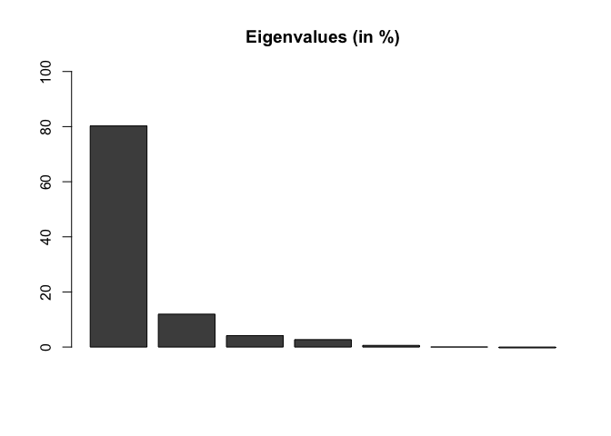
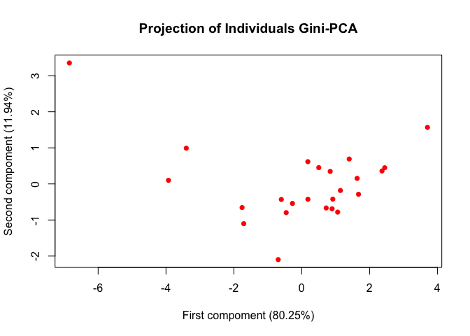
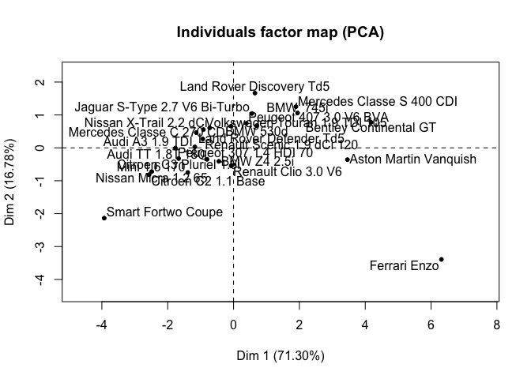
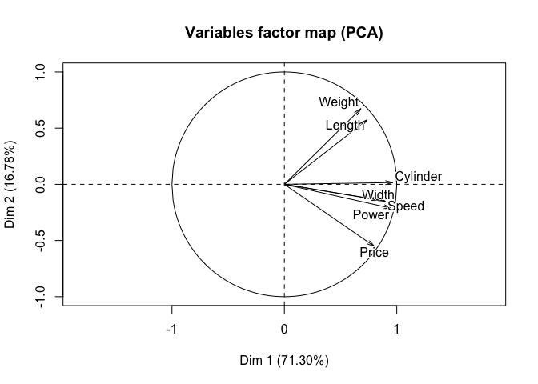

Principal Component Analysis : A Generalized Gini Approach
================
Arthur Charpentier, Stéphane Mussard & Téa Ouraga

``` r
library(knitr)
library(plotrix)
library(FactoMineR)
download.file(url = "http://freakonometrics.free.fr/cars.csv", destfile = "cars.csv")
df = read.table("cars.csv",sep=";",header=TRUE)
X  = df[,2:8]
rownames(X) = as.character(df[,1])
colnames(X) = names(df[,2:8])
n = nrow(X)
k = ncol(X)
```

Set the risk aversion parameter,

``` r
nu = 2 
```

# Gini correlation

Define the decumulative matrix of ranks of `X`,

``` r
rX = matrix(1,n,k)  
for (i in 1:k) 
  {
    rX[,i] = (n+1)*rX[,i] - rank(X[,i],T, "average")
    rX[,i] = (rX[,i])^(nu-1) - mean((rX[,i])^(nu-1))*matrix(1,n,1)
  }
```

Define then a centered version of `X`

``` r
Xc = matrix(0,n,k) 
for (i in 1:k) 
  {
    Xc[,i] = X[,i] - mean(X[,i])*matrix(1,n,1)
  }
```

Matrix `GMDX` is then defined as

``` r
GMDX = (-2/(n*(n-1)))*nu * t(X) %*% rX
deno1 = matrix(0,k,k)
for (i in 1:k) 
      {
        deno1[i,] = matrix(1,1,k)*GMDX[i,i]
      }
```

Gini Correlation matrix of `X`, `GMDX` is then

``` r
GCX = GMDX / deno1   
```

# Eigenvalues and eigenvectors

Then set `GMD`

``` r
GMD = t(GCX) + GCX     
```

with eigenvalues

``` r
valP = eigen(GMD)$values 
```

with eigenvectors

``` r
vecP = eigen(GMD)$vectors   
```

Percentages of eigenvalues are

``` r
Pva = matrix(0,1,k)       
for (i in 1:k) 
  {
    Pva[i] = valP[i] / (sum(abs(valP)))
  }
```

A normalized version is then

``` r
for (i in 1:k) 
  {
    vecP[,i] = vecP[,i] / (sqrt(as.numeric(t(vecP[,i])%*%vecP[,i])))
  }
```

# Projections and Contributions

Matrix `Z` of standardized variables is then

``` r
Z = matrix(0,n,k)
for (i in 1:k) 
  {
    Z[,i] = Xc[,i] / GMDX[i,i] 
  }
```

Define then ranks of matrix `Z`

``` r
rZ = matrix(0,n,k)
for (i in 1:k) 
  {
    rZ[,i] = (n+1)*matrix(1,n,1) - rank(Z[,i],T, "average") 
    rZ[,i] = (rZ[,i])^(nu-1) - mean((rZ[,i])^(nu-1))*matrix(1,n,1)
  }
```

and then the matrix of correlation of \(Z\) `GMDZ`

``` r
GMDZ = (-2/(n*(n-1)))*nu * t(Z) %*% rZ
```

Projection of the individuals in the new space

``` r
F1 = Z %*% vecP  
rF = matrix(1,n,k)  
for (i in 1:k) 
  {
    rF[,i] = (n+1)*rF[,i] - rank(F1[,i],T, "average")
    rF[,i] = (rF[,i])^(nu-1) - (mean(rF[,i])^(nu-1))*matrix(1,n,1)
  } 
```

Define absolute contributions `CTA` for individuals

``` r
CTAi = matrix(0,n,k)
for (i in 1:k) 
  {
    CTAi[,i] = ( (-2/(n*(n-1)))* nu * (F1[,i]*(rZ%*%vecP[,i])) ) / (valP[i]/2) 
  }
CTAi = CTAi*100
```

In the new space, the \(G\)-correlation is

``` r
GMDF1 = (-2/(n*(n-1)))*nu * t(F1) %*% rF
deno2 = matrix(0,k,k) 
for (i in 1:k) 
  {
    deno2[i,] = matrix(1,1,k)*GMDF1[i,i]  
  }
  GCF1 = GMDF1 / deno2
```

Relative contributions are here

``` r
CTRi = matrix(0,n,k)
for (i in 1:n) 
  {
  CTRi[i,] = abs(F1[i,]) / sum(abs(F1[i,])) 
  }
CTRi = CTRi*100
CTRi
```

    ##            [,1]      [,2]        [,3]      [,4]       [,5]      [,6]
    ##  [1,] 69.793702 12.781456  7.23057500  3.631697  3.8632630 1.8505609
    ##  [2,] 53.692405 22.691927  4.03590612 15.009266  1.5790001 0.7180572
    ##  [3,] 44.786583 22.095818 11.90737548  4.759300 11.5449719 2.7499588
    ##  [4,] 68.882375 10.441174  7.53549066  2.816599  5.8200025 3.2037814
    ##  [5,]  7.030841 23.945048 16.51140679 12.339970 18.0900563 6.7649385
    ##  [6,] 61.610059  9.833353  4.26795770 15.243712  4.0972754 3.7781969
    ##  [7,] 56.192441  9.624542 10.81481463 13.846597  5.4730511 3.1640205
    ##  [8,] 14.782136 29.272136 27.23181038 17.954937  0.7644978 0.5112949
    ##  [9,]  9.689985 22.541744 38.16564207 15.005365  5.2796041 7.4212826
    ## [10,] 26.577882 18.999393 19.14945322 27.294277  0.5648878 2.9678502
    ## [11,] 18.851462 32.862239 21.10132782 21.871624  0.9784022 2.0024690
    ## [12,] 44.034273 16.436841 15.45747574  4.244214  2.7454251 5.0529753
    ## [13,] 37.067846 23.931394  0.08273187  8.326054 10.5539815 6.7331137
    ## [14,] 78.824883  7.424633  3.32801196  7.527424  0.6155970 0.3064449
    ## [15,] 24.683117 22.204832 14.13651983 11.480222  8.3451236 8.0273623
    ## [16,] 37.849539 15.661650 12.98648875 12.056610 16.6969722 3.7990563
    ## [17,] 53.346159 15.533631  7.01139418  8.731839 12.1847621 1.3768458
    ## [18,] 58.447811  1.483424 19.19942978 14.871813  0.9165751 4.9043235
    ## [19,] 42.581633 20.850196 20.05596856  1.319443  3.5747153 1.4310556
    ## [20,] 50.387805 23.173712  4.82746192 11.160312  5.9011179 3.5512239
    ## [21,] 44.545469 34.276649  3.17613666 11.908331  1.1072416 1.7424500
    ## [22,] 31.306568 23.105558  9.42897879 27.022804  4.5330837 3.0260991
    ## [23,] 13.116194 39.751655 21.99416004  6.329065 13.0944669 4.6753259
    ## [24,] 36.848060 34.077525  4.54718324  9.534349  8.1979036 6.4169947
    ##             [,7]
    ##  [1,]  0.8487469
    ##  [2,]  2.2734381
    ##  [3,]  2.1559936
    ##  [4,]  1.3005774
    ##  [5,] 15.3177394
    ##  [6,]  1.1694462
    ##  [7,]  0.8845335
    ##  [8,]  9.4831875
    ##  [9,]  1.8963766
    ## [10,]  4.4462572
    ## [11,]  2.3324757
    ## [12,] 12.0287969
    ## [13,] 13.3048783
    ## [14,]  1.9730060
    ## [15,] 11.1228226
    ## [16,]  0.9496833
    ## [17,]  1.8153691
    ## [18,]  0.1766234
    ## [19,] 10.1869886
    ## [20,]  0.9983667
    ## [21,]  3.2437222
    ## [22,]  1.5769082
    ## [23,]  1.0391326
    ## [24,]  0.3779850

We can also project variables

``` r
V1 = matrix(0,n,k)
F2 = matrix(0,n,k)
for (i in 1:k) 
  {
  F2[,i] = F1[,i] / GMDF1[i,i] 
  }
V1 = (-2/(n*(n-1)))* nu * t(t(F2)%*%rZ)
```

``` r
V2 = matrix(0,n,k)
V2 = (1/n)*t(t(F2)%*%Z)    
```

The \(G\)-correlation matrix
    is

``` r
GCX 
```

    ##               [,1]      [,2]      [,3]      [,4]      [,5]      [,6]
    ## Cylinder 1.0000000 0.9642621 0.9025021 0.7346669 0.8839674 0.7316542
    ## Power    0.9554000 1.0000000 0.9646860 0.5605873 0.8245048 0.6209231
    ## Speed    0.8472325 0.9481692 1.0000000 0.4510360 0.6802157 0.5821743
    ## Weight   0.8111044 0.6868411 0.5070968 1.0000000 0.8298818 0.8179392
    ## Width    0.8366162 0.7860442 0.6570339 0.5681349 1.0000000 0.7433090
    ## Length   0.8276088 0.7268135 0.6787153 0.8519776 0.8510951 1.0000000
    ## Price    0.9623000 0.9738924 0.9512263 0.2729861 0.9184290 0.5448818
    ##               [,7]
    ## Cylinder 0.9352052
    ## Power    0.9250034
    ## Speed    0.7943798
    ## Weight   0.7333099
    ## Width    0.8211874
    ## Length   0.6925287
    ## Price    1.0000000

Project individuals

``` r
F1
```

    ##             [,1]        [,2]         [,3]        [,4]        [,5]
    ##  [1,]  2.4459564  0.44793275  0.253399248 -0.12727469 -0.13539005
    ##  [2,]  3.7067260  1.56656713  0.278624103  1.03618449 -0.10900836
    ##  [3,]  1.3996407  0.69052393 -0.372121447  0.14873450  0.36079585
    ##  [4,]  2.3662559  0.35867651  0.258860108 -0.09675614 -0.19992945
    ##  [5,]  0.1811390  0.61690790 -0.425391395  0.31792064  0.46606291
    ##  [6,]  1.1405422 -0.18203771  0.079009593 -0.28219573 -0.07584988
    ##  [7,]  1.6739928 -0.28671855  0.322177179 -0.41249505 -0.16304414
    ##  [8,] -0.2730110 -0.54062652 -0.502943785 -0.33160940  0.01411949
    ##  [9,]  0.1826402 -0.42487470 -0.719359400 -0.28282638 -0.09951183
    ## [10,] -0.6013608 -0.42988715 -0.433282455 -0.61757018 -0.01278136
    ## [11,] -0.4570300 -0.79670361 -0.511575121 -0.53024997 -0.02372013
    ## [12,] -1.7574257 -0.65600097 -0.616914118 -0.16938829 -0.10957103
    ## [13,] -1.7079112 -1.10264554  0.003811894 -0.38362524  0.48627759
    ## [14,]  1.6339421  0.15390344 -0.068985560 -0.15603417  0.01276056
    ## [15,]  0.5022107  0.45178672 -0.287626223 -0.23358033  0.16979260
    ## [16,]  0.8396479  0.34743546 -0.288090129 -0.26746186  0.37040288
    ## [17,] -3.4022371  0.99068230 -0.447162943  0.55688707 -0.77710280
    ## [18,] -3.9269954  0.09966842 -1.289972558  0.99920833 -0.06158291
    ## [19,] -6.8472315  3.35276284  3.225049141  0.21216967 -0.57482302
    ## [20,]  0.9159955 -0.42127287  0.087758006 -0.20288234  0.10727590
    ## [21,]  0.8955687 -0.68911824  0.063854949 -0.23941221 -0.02226065
    ## [22,]  1.0599032 -0.78225294  0.319223900  0.91487373 -0.15347035
    ## [23,] -0.6921556 -2.09773726  1.160655292  0.33399151  0.69100899
    ## [24,]  0.7211968 -0.66697136 -0.088998278 -0.18660797 -0.16045083
    ##               [,6]        [,7]
    ##  [1,] -0.064853867 -0.02974478
    ##  [2,] -0.049572023  0.15694980
    ##  [3,]  0.085939899  0.06737769
    ##  [4,] -0.110056695 -0.04467760
    ##  [5,]  0.174288397 -0.39463836
    ##  [6,]  0.069943008 -0.02164911
    ##  [7,] -0.094257298  0.02635057
    ##  [8,]  0.009443095 -0.17514481
    ##  [9,]  0.139878937 -0.03574357
    ## [10,]  0.067151652 -0.10060262
    ## [11,] -0.048547339  0.05654794
    ## [12,] -0.201666293 -0.48007416
    ## [13,]  0.310230060 -0.61302592
    ## [14,] -0.006352222 -0.04089797
    ## [15,]  0.163327320 -0.22630856
    ## [16,]  0.084277640  0.02106762
    ## [17,] -0.087810555  0.11577808
    ## [18,] -0.329512010 -0.01186698
    ## [19,] -0.230117272  1.63809286
    ## [20,]  0.064557387  0.01814922
    ## [21,]  0.035031256  0.06521373
    ## [22,] -0.102450454 -0.05338720
    ## [23,]  0.246721935  0.05483614
    ## [24,] -0.125594560  0.00739799

Individuals \(CTA\) are

``` r
CTAi
```

    ##              [,1]        [,2]        [,3]       [,4]         [,5]
    ##  [1,]  8.34947614  0.72726026 -0.81876299  0.7462662  -1.25329327
    ##  [2,] 13.03259475  5.86403851  1.86266907  3.6732439   6.64051050
    ##  [3,]  2.53010902  4.53443351  4.23501401  1.3397530  20.68628502
    ##  [4,]  7.55492871  0.22330125  0.16894091  0.2090478   1.81984662
    ##  [5,] -0.12348242  4.88421289  1.26150038  6.2684176  30.05290053
    ##  [6,]  1.34014932  0.16488392  0.10408169  2.2296475   2.09856651
    ##  [7,]  3.88275952  0.44656004  0.72163035  6.9625449  -0.34185950
    ##  [8,]  0.34326022  1.12482888  0.26367616 -1.0321893  -0.12307239
    ##  [9,] -0.03492577  0.55212355 13.71626449 -0.2331286   5.69632698
    ## [10,]  1.23193738 -0.22993996 -0.71274229  8.0514123   0.50214075
    ## [11,]  0.80240222  3.09403148 -0.58352545  4.8267546   0.80327133
    ## [12,]  4.99794272  1.21605053  2.77563141  0.8498274   2.28820514
    ## [13,]  4.69312588  5.24817164 -0.01167299  3.9706544  19.01464613
    ## [14,]  3.78991604  0.26847881  0.44821612  1.7976765   0.41359758
    ## [15,] -0.02767860  3.57492028  0.39131017  0.8055767  -0.05030791
    ## [16,]  0.75866127  1.53932677  1.72225497  0.5739281  16.98290899
    ## [17,]  9.72695267  2.74182225 -0.14882425  6.8950902 -11.53819374
    ## [18,] 12.90669600 -0.06059637 10.06598339 10.1694513  -0.29901387
    ## [19,] 20.60339283 28.86390817 30.68350120 -2.6477146  -1.40078149
    ## [20,]  0.76773975  1.44556879  0.22234117  1.7908256   7.33809776
    ## [21,]  0.95405999  4.35912081  0.26319520  1.2822501  -0.46022618
    ## [22,]  0.75779609  3.66374872  3.70417529 37.5005588   7.21487673
    ## [23,]  0.75629279 23.00896819 29.58446382  4.2630584 -12.33035801
    ## [24,]  0.40589348  2.74477704  0.08067817 -0.2929526   6.24492579
    ##              [,6]          [,7]
    ##  [1,] -16.9183875  -1.424288926
    ##  [2,]   6.3735790 -17.073668965
    ##  [3,] -38.2884696  -0.007976594
    ##  [4,]  18.5534689  -1.989071150
    ##  [5,]  61.8019931 -48.854034956
    ##  [6,]  54.1276195  -0.132954908
    ##  [7,]  -1.5206374   0.739270915
    ##  [8,]  -3.7325877  -7.310488984
    ##  [9,]  22.3787566   0.971642683
    ## [10,]  -8.8020725   1.001437098
    ## [11,]  13.9682820  -5.960202093
    ## [12,]  45.5178048  20.572995276
    ## [13,]  38.0647579 -20.398834387
    ## [14,]   0.4393361  -3.481741074
    ## [15,]  -0.3919348  10.512962298
    ## [16,] -57.0750852  -1.043141671
    ## [17,] -31.5236395  -4.188017922
    ## [18,] -69.7860264   0.409231249
    ## [19,]   1.9893338 177.641808005
    ## [20,]  41.5952065   0.703649945
    ## [21,]  23.5519447   4.970917482
    ## [22,]  21.7203336   1.401142144
    ## [23,] -83.1593872  -6.906211938
    ## [24,]  61.1158113  -0.154423526

while individuals \(CTR\)
    are

``` r
CTRi
```

    ##            [,1]      [,2]        [,3]      [,4]       [,5]      [,6]
    ##  [1,] 69.793702 12.781456  7.23057500  3.631697  3.8632630 1.8505609
    ##  [2,] 53.692405 22.691927  4.03590612 15.009266  1.5790001 0.7180572
    ##  [3,] 44.786583 22.095818 11.90737548  4.759300 11.5449719 2.7499588
    ##  [4,] 68.882375 10.441174  7.53549066  2.816599  5.8200025 3.2037814
    ##  [5,]  7.030841 23.945048 16.51140679 12.339970 18.0900563 6.7649385
    ##  [6,] 61.610059  9.833353  4.26795770 15.243712  4.0972754 3.7781969
    ##  [7,] 56.192441  9.624542 10.81481463 13.846597  5.4730511 3.1640205
    ##  [8,] 14.782136 29.272136 27.23181038 17.954937  0.7644978 0.5112949
    ##  [9,]  9.689985 22.541744 38.16564207 15.005365  5.2796041 7.4212826
    ## [10,] 26.577882 18.999393 19.14945322 27.294277  0.5648878 2.9678502
    ## [11,] 18.851462 32.862239 21.10132782 21.871624  0.9784022 2.0024690
    ## [12,] 44.034273 16.436841 15.45747574  4.244214  2.7454251 5.0529753
    ## [13,] 37.067846 23.931394  0.08273187  8.326054 10.5539815 6.7331137
    ## [14,] 78.824883  7.424633  3.32801196  7.527424  0.6155970 0.3064449
    ## [15,] 24.683117 22.204832 14.13651983 11.480222  8.3451236 8.0273623
    ## [16,] 37.849539 15.661650 12.98648875 12.056610 16.6969722 3.7990563
    ## [17,] 53.346159 15.533631  7.01139418  8.731839 12.1847621 1.3768458
    ## [18,] 58.447811  1.483424 19.19942978 14.871813  0.9165751 4.9043235
    ## [19,] 42.581633 20.850196 20.05596856  1.319443  3.5747153 1.4310556
    ## [20,] 50.387805 23.173712  4.82746192 11.160312  5.9011179 3.5512239
    ## [21,] 44.545469 34.276649  3.17613666 11.908331  1.1072416 1.7424500
    ## [22,] 31.306568 23.105558  9.42897879 27.022804  4.5330837 3.0260991
    ## [23,] 13.116194 39.751655 21.99416004  6.329065 13.0944669 4.6753259
    ## [24,] 36.848060 34.077525  4.54718324  9.534349  8.1979036 6.4169947
    ##             [,7]
    ##  [1,]  0.8487469
    ##  [2,]  2.2734381
    ##  [3,]  2.1559936
    ##  [4,]  1.3005774
    ##  [5,] 15.3177394
    ##  [6,]  1.1694462
    ##  [7,]  0.8845335
    ##  [8,]  9.4831875
    ##  [9,]  1.8963766
    ## [10,]  4.4462572
    ## [11,]  2.3324757
    ## [12,] 12.0287969
    ## [13,] 13.3048783
    ## [14,]  1.9730060
    ## [15,] 11.1228226
    ## [16,]  0.9496833
    ## [17,]  1.8153691
    ## [18,]  0.1766234
    ## [19,] 10.1869886
    ## [20,]  0.9983667
    ## [21,]  3.2437222
    ## [22,]  1.5769082
    ## [23,]  1.0391326
    ## [24,]  0.3779850

Matrix of correlations in the new space \(GMD(F,Rz)\) is

``` r
V1
```

    ##            [,1]        [,2]        [,3]        [,4]        [,5]
    ## [1,] -0.9758238 -0.01023717 -0.04512601  0.10421466 -0.16187526
    ## [2,] -0.9550747  0.15915354 -0.10259509  0.06103312 -0.04224919
    ## [3,] -0.8914751  0.29582943 -0.18039957 -0.11790930 -0.13885960
    ## [4,] -0.6797591 -0.57484114 -0.29271174  0.10872724  0.09538064
    ## [5,] -0.9332868 -0.16031261  0.22727499  0.05301549  0.01035947
    ## [6,] -0.7779144 -0.40365559 -0.05763456 -0.30903551 -0.04400623
    ## [7,] -0.9250874  0.07662205  0.04539688  0.21286195 -0.14239970
    ##              [,6]        [,7]
    ## [1,] -0.127740699  0.11952133
    ## [2,] -0.083468552  0.12534707
    ## [3,] -0.069729852  0.12554570
    ## [4,]  0.011794228 -0.30146834
    ## [5,] -0.003585305  0.19498220
    ## [6,] -0.037361289 -0.02776397
    ## [7,] -0.132684574  0.24250117

``` r
Z1 = matrix(0,n,k)
for (i in 1:k) 
  {
    Z1[,i] = Xc[,i] / GMDX[i,i] 
  }
rZ1 = matrix(0,n,k)
for (i in 1:k) 
  {
    rZ1[,i] = (n+1)*matrix(1,n,1) - rank(Z1[,i],T, "average") 
    rZ1[,i] = (rZ1[,i])^(nu[1]-1) - mean((rZ1[,i])^(nu[1]-1))*matrix(1,n,1)
  }
GMDZ1 = (-2/(n*(n-1)))*nu[1] * t(Z1) %*% rZ1
```

# Testing for correlations between the Variables \(Z\) and the components \(F\)

``` r
Stock1 = Stock2 =  matrix(0,k,k)
axe1 = axe2 = matrix(0,n,k) ; norm1 = matrix(0,n-1,k)
for ( i in 1:n) {
    F12 = matrix(data = 0, nrow = n-1, ncol = k)  
    F12 = F1[-i,] 
    rF12 = matrix(data = 1, nrow = n-1, ncol = k)
    Z12 = matrix( 0, n-1, k)
    Z12 = Z1[-i,] 
    rZ12 = matrix(1,n-1,k)
    for ( j in 1:k) 
      {
        rF12[,j] = n*matrix(1,n-1,1) - rank(F12[,j],T, "average")
        rF12[,j] = (rF12[,j])^(nu[1]-1) - (mean(rF12[,j])^(nu[1]-1))*matrix(1,n-1,1)
        rZ12[,j] = n*matrix(1,n-1,1) - rank(Z12[,j],T, "average")
        rZ12[,j] = (rZ12[,j])^(nu[1]-1) - mean((rZ12[,j])^(nu[1]-1))*matrix(1,n-1,1)
      }
    Stock1 = (-2/ ((n-1)*(n-2)) )*nu[1] * t(F12) %*% rF12
    for (l in 1:k)
    {
        norm1[,l] = F12[,l]/Stock1[l,l]  
        Stock2 = (-2/((n-1)*(n-2)))* nu[1] * (t(norm1)%*%rZ12)
    }
    axe1[i,] = Stock2[1,]
    axe2[i,] = Stock2[2,]
}
colnames(axe1) = colnames(axe2) = colnames(X)
```

Use Jackknife to compute standard deviations of the correlations,

``` r
Var_jfk_axe1 = Var_jfk_axe2 = ET_jkf_axe1 = ET_jkf_axe2 = matrix(0,1,k)
for ( i in 1:k) 
  {
    Var_jfk_axe1[,i] = ((n-1)/n)*colSums( (axe1[,i]-mean(axe1[,i])*matrix(1,n,1))^2 )
    ET_jkf_axe1[,i] = Var_jfk_axe1[,i]^(0.5)
    Var_jfk_axe2[,i] = ((n-1)/n)*colSums( (axe2[,i]-mean(axe2[,i])*matrix(1,n,1))^2 )
    ET_jkf_axe2[,i] = Var_jfk_axe2[,i]^(0.5)
  }
row.names(ET_jkf_axe1) = "ET_jkf_axe1" 
row.names(ET_jkf_axe2) = "ET_jkf_axe2"
colnames(ET_jkf_axe1) = colnames(ET_jkf_axe2) =colnames(X)
ET_jkf = rbind(ET_jkf_axe1,ET_jkf_axe2)

ratio = matrix(0,2,k)
for (i in 1:2) {
    ratio[i,] = GCF1[i,] / ET_jkf[i,]
}
row.names(ratio) = c("axis1", "axis2") 
colnames(ratio) = colnames(X)
```

Results of the Test : \(U\)-stat of the correlations between variables
and
    components

``` r
ratio  
```

    ##         Cylinder      Power     Speed     Weight      Width    Length
    ## axis1 71.1747111 -0.8797293 3.3050637 -0.4889438  3.6388613  3.173544
    ## axis2  0.1161839  2.7511305 0.5360694  2.5822381 -0.9563135 -1.176090
    ##           Price
    ## axis1 -2.203973
    ## axis2  1.163271

# Graphs

The graph with percentages of eigenvalues

``` r
barplot(Pva*100, main="Eigenvalues (in %)",ylim = c(0,100))  
```

<!-- -->

Two-dimensional scatterplot

``` r
plot(F1[,1], F1[,2], pch=16, col="red", 
     main="Projection of Individuals Gini-PCA",
     xlab=paste("First compoment (",round(Pva[1]*100,2),"%)",sep=""), 
     ylab=paste("Second compoment (",round(Pva[2]*100,2),"%)",sep=""))
```

<!-- -->

Classical
\(L^2\)-PCA

``` r
res.pca = FactoMineR::PCA(X)
```

<!-- --><!-- -->

``` r
round(res.pca$ind$coord, 3)
```

    ##                                Dim.1  Dim.2  Dim.3  Dim.4  Dim.5
    ## Citroen C2 1.1 Base           -2.564 -0.816  0.118 -0.172  0.166
    ## Smart Fortwo Coupe            -3.928 -2.136 -0.479  0.918 -0.007
    ## Mini 1.6 170                  -1.391 -0.748 -0.574  0.031 -0.445
    ## Nissan Micra 1.2 65           -2.485 -0.720  0.148 -0.124  0.255
    ## Renault Clio 3.0 V6           -0.073 -0.545 -0.715  0.216 -0.585
    ## Audi A3 1.9 TDI               -1.175  0.029  0.221 -0.261  0.103
    ## Peugeot 307 1.4 HDI 70        -1.766 -0.006  0.527 -0.347  0.293
    ## Peugeot 407 3.0 V6 BVA         0.385  0.743 -0.189 -0.319  0.037
    ## Mercedes Classe C 270 CDI     -0.077  0.661 -0.421 -0.323  0.059
    ## BMW 530d                       0.708  0.678 -0.127 -0.662  0.013
    ## Jaguar S-Type 2.7 V6 Bi-Turbo  0.556  1.044 -0.026 -0.494  0.119
    ## BMW  745i                      1.945  1.060 -0.359 -0.146  0.219
    ## Mercedes Classe S 400 CDI      1.895  1.250  0.436 -0.205 -0.424
    ## Citroen C3 Pluriel 1.6i       -1.667 -0.325 -0.054 -0.185  0.013
    ## BMW Z4 2.5i                   -0.446 -0.409 -0.415 -0.368 -0.280
    ## Audi TT 1.8T 180              -0.806 -0.350 -0.301 -0.361 -0.409
    ## Aston Martin Vanquish          3.459 -0.358 -1.068  0.259  0.457
    ## Bentley Continental GT         4.176  0.775 -1.481  0.899 -0.003
    ## Ferrari Enzo                   6.313 -3.391  1.376 -0.222  0.039
    ## Renault Scenic 1.9 dCi 120    -0.933  0.271  0.331 -0.112 -0.031
    ## Volkswagen Touran 1.9 TDI 105 -0.916  0.555  0.427 -0.112  0.133
    ## Land Rover Defender Td5       -1.135  0.464  0.470  1.218  0.340
    ## Land Rover Discovery Td5       0.650  1.665  1.902  0.951 -0.371
    ## Nissan X-Trail 2.2 dCi        -0.726  0.608  0.253 -0.079  0.311
